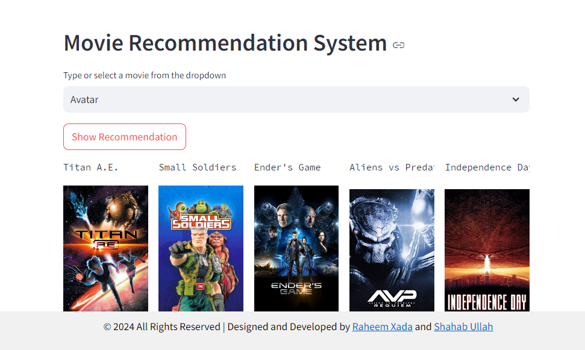

# Movie Recommendation System

This project involves the development of a movie recommender system leveraging the TMDB dataset. The objective is to provide personalized movie recommendations to users based on their preferences and viewing history. The project encompasses various stages including data collection, preprocessing, analysis, and model building.




## Installation

1. **Clone the repository:**
    ```bash
    git clone https://github.com/Coding-Scorpion/Movie-Recommendation-System-Using-Machine-Learning.git
    git clone git@github.com:UmarFarooq-DS/Movie_Recommender_System.git
    cd Movie_Recommender_System/
    ```

2. **Download the dataset:**
   Download the [TMDB 5000 Movie Dataset](https://www.kaggle.com/tmdb/tmdb-movie-metadata) and place it in the project directory folder.
  

3. **Install the required libraries:**
    ```bash
    pip install -r requirements.txt
    ```

## Usage

To use the Movie Recommendation System, follow the steps below:

1. Open a terminal or command prompt.
2. Navigate to the project directory.
3. Run the Streamlit app:
    ```bash
    streamlit run app.py
    ```

The app will open in your default web browser, and you can start using the movie recommendation system.

